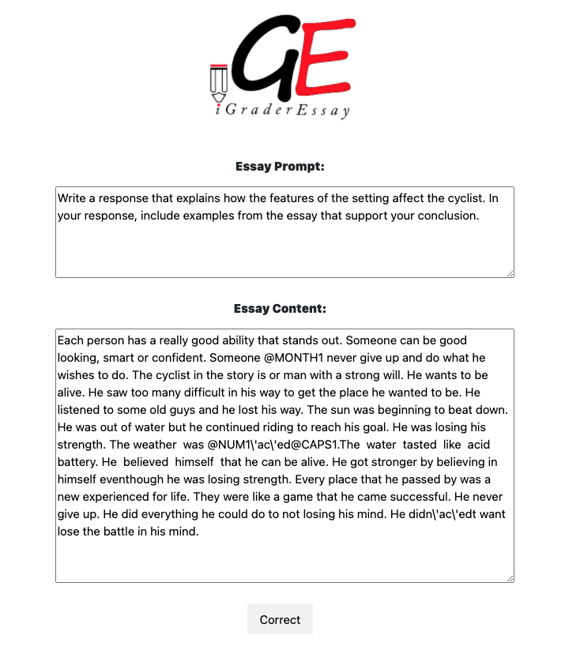

# iGrader Essay

<div style="text-align:center"></div>

## Automated Grading System for everyone

IGrader Essay is an Automated Essay Grading systems platform based on AI, it is a tool that can help you grade essays in English. It is used in conjunction or even independently of a human grader. Handy for busy teachers, or to students having doubts. It needs your essay and its prompt, to give your deserved grade and some feedback. Released in 2021, by motivated students in France, it is a friend who is never tired to help with your essays.


Input section           |  Results section
:-------------------------:|:-------------------------:
<div style="text-align:center"></div>  |  <div style="text-align:center"></div>


<br><br>

## Why *__iGrader Essay__* is different?

In all reviewed automated grading systems, only the embedding technique was adopted, howerever, in our application we followed more complex path. We extract features that real techer based his grading on to train our multi-layer perceptron.
find the list of some extracted features:

 * Number of mistakes
 * Number of words
 * Lexical divercity
 * Average sparce tree height
 * Inner similarity : We used *BERT* model to embedd essays' sentences and compute *cosine similarity distance* between them.
 * Text coherence
 * Number of transition words
 * Prompt and essay relevance
 
## Running locally 

A step by step series of examples that tell you how to get a development env running

After cloning the repository in your local machine, create a cinda environment by running the following line:

```
conda create --name igrader-essay-env pyhon=3.6
```

And then install the required dependencies by running the following line

```
pip3 install -r requirenment.txt
```

At the end run the application locally:
```
python app.py
```
The default develpment URL is ```http://0.0.0.0:5000/``` 

## Built With

* [Flask](https://flask.palletsprojects.com/en/1.1.x/) - The web framework used
* [Docker](https://docs.docker.com/) - Dependency Management & Envirenment
* [Azure Microsoft](https://docs.microsoft.com/en-us/azure/?product=ai-machine-learning) - Used to host the application

## Contributing

If you want to contribute to a project and make it better, your help is very welcome. Contributing is also a great way to learn more about social coding on Github, new technologies and and their ecosystems and how to make constructive, helpful bug reports, feature requests and the noblest of all contributions: a good, clean pull request.

## Authors

* **Abdelhak Zabour** - *Initial work* -
* **Jehona Kryeziu** - *Initial work* -
* **Meziane Bellahmer** - *Initial work* -

See also the list of [contributors](https://github.com/zaboura/iGrader-Essay-App/graphs/contributors) who participated in this project.


## License

This project is licensed under Attribution-NonCommmercial-ShareAlike 4.0 International.
[](https://creativecommons.org/licenses/by-nc-sa/4.0/)
